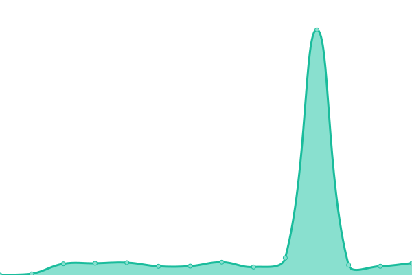
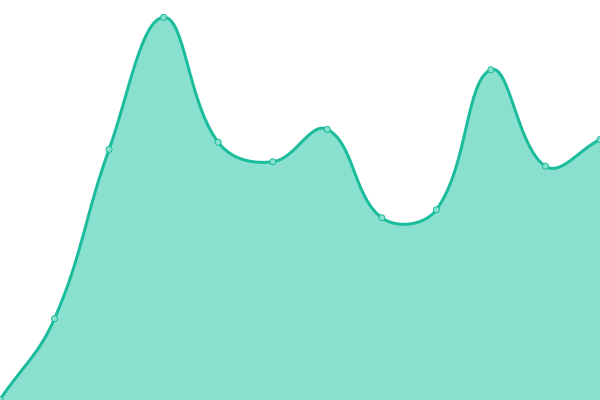
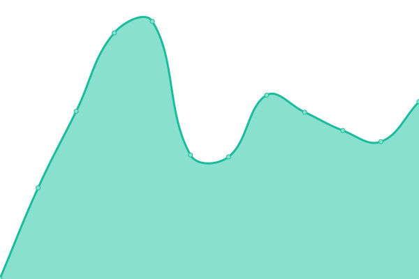
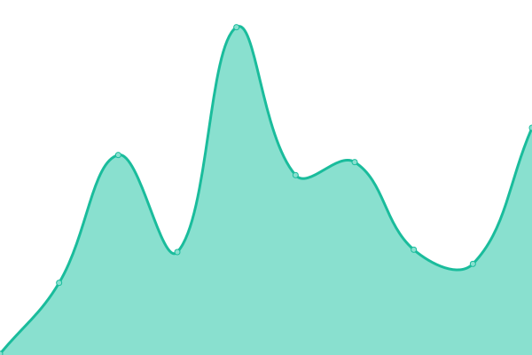

# [📈 Live Status](https://status.nr1a.inc): <!--live status--> **🟩 All systems operational**

This repository contains the open-source uptime monitor and status page for [nr1a](https://status.nr1a.inc), powered by [Upptime](https://github.com/upptime/upptime).

With [Upptime](https://upptime.js.org), you can get your own unlimited and free uptime monitor and status page, powered entirely by a GitHub repository. We use [Issues](https://github.com/nr1a/nr1ainc-uptime/issues) as incident reports, [Actions](https://github.com/nr1a/nr1ainc-uptime/actions) as uptime monitors, and [Pages](https://status.nr1a.inc) for the status page.

<!--start: status pages-->
<!-- This summary is generated by Upptime (https://github.com/upptime/upptime) -->
<!-- Do not edit this manually, your changes will be overwritten -->
<!-- prettier-ignore -->
| URL | Status | History | Response Time | Uptime |
| --- | ------ | ------- | ------------- | ------ |
|  [Misskey](https://lo.nr1a.inc) | 🟩 Up | [misskey.yml](https://github.com/nr1a/nr1ainc-uptime/commits/HEAD/history/misskey.yml) | 

 411ms
     
 | 

<a href="https://status.nr1a.inc/history/misskey">100.00%</a>
    

|  [DEV](https://lq.nr1a.inc) | 🟩 Up | [dev.yml](https://github.com/nr1a/nr1ainc-uptime/commits/HEAD/history/dev.yml) | 

 434ms
     
 | 

<a href="https://status.nr1a.inc/history/dev">100.00%</a>
    

|  [omaka](https://omaka.nr1a.inc) | 🟩 Up | [omaka.yml](https://github.com/nr1a/nr1ainc-uptime/commits/HEAD/history/omaka.yml) | 

 545ms
     
 | 

<a href="https://status.nr1a.inc/history/omaka">99.44%</a>
    

|  [Vault](https://vault.nr1a.inc) | 🟩 Up | [vault.yml](https://github.com/nr1a/nr1ainc-uptime/commits/HEAD/history/vault.yml) | 

 543ms
     
 | 

<a href="https://status.nr1a.inc/history/vault">100.00%</a>
    

|  [Blog](https://blog.nr1a.inc) | 🟩 Up | [blog.yml](https://github.com/nr1a/nr1ainc-uptime/commits/HEAD/history/blog.yml) | 

 106ms
     
 | 

<a href="https://status.nr1a.inc/history/blog">100.00%</a>
    

<!--end: status pages-->

[**Visit our status website →**](https://status.nr1a.inc)

## 📄 License

- Powered by: [Upptime](https://github.com/upptime/upptime)
- Code: [MIT](./LICENSE) © [Anand Chowdhary](https://anandchowdhary.com), supported by [Pabio](https://pabio.com)
- Data in the `./history` directory: [Open Database License](https://opendatacommons.org/licenses/odbl/1-0/)
